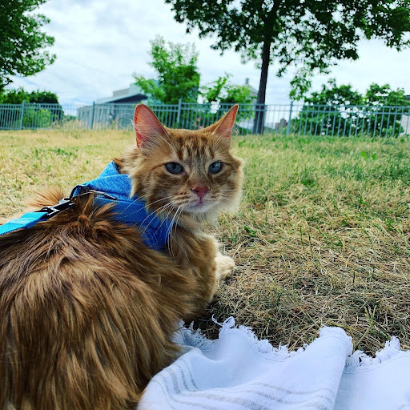

# Pumpkin
Pumpkin was initially created to do the analysis found in [arxiv 2009.00643](https://arxiv.org/abs/2009.00643). However, we have since
decided to expand Pumpkin to include general purpose fitting in order to make
thermodynamic maps and line plots. We are currently working on updating the code
and including several examples to make this processes more simple and quick! If you
need help with this immediately, please send me an email at carter.rhea@umontreal.ca.


In order to create thermodynamic maps of a cluster (say temperature and metallicity),
we first need to bin a our image so that each bin will have an appropriate signal-to-noise
so that we can trust our results. We also have to define the fitting and background
functions we wish to use. Pumpkin currently contains an absorbed `apec` model for
the cluster emission and a standard background model containing both local X-ray emission,
background AGN, and diffuse background emission. However, Pumpkin can be easily modified
to use different functions (Lines 64-92 in `Temperatures/Fits.py`). Before you
can run the pipeline, you need to use the `chandra_download_obsid` command from `ciao`
to download the ObsIDs of interest.

There are two primary pipelines in Pumpkin: one to clean the data and another to
fit the data.

## Cleaning Pipeline
The cleaning pipeline can be found in the `DataCleaning` directory and can be run using the following command (from the `DataCleaning` directory):
```
python DataCleaningPipeline.py input.i
```
* Be sure to have updated the input.i file!! *


## Fitting Pipeline
Create profile for galaxy cluster by fitting spectra.

This program will results in:
- Spectra for each region
- Temperature, Abundance, Cooling Time, Pressure, and Density Plots


In order to run this program you need the following:
1. Reprocessed Chandra ObsIDs -- this can be created using the `DataCleaningPipeline`
described above.

  example: 4636/repro/

To run the program please supply those items (and other relevant info) in an input file (example.i)
and execute the following command:

`python Temperature_Profiles.py Inputs/example.i`

You need to set the several paths and three key parameters for the fits:
  1. The number of annuli
  2. The redshift of the cluster
  3. The column density of the cluster. You can use [this tool](https://heasarc.gsfc.nasa.gov/cgi-bin/Tools/w3nh/w3nh.pl)
  to find the column density. I use the weighted average nH. Also, this value needs
  to be in units of 10^{22} cm^{-2}. So if the website returns a weighted average value
  of 5E+21 you should input 0.5 in the input file.

Region files should be in the regions sub-directory. They should be labeled by name_count
where count corresponds to their annulus number. For example, if we have two regions, ann_1 and ann_2,
then ann_2 would be the outer annulus and ann_1 would be the inner annulus.

What does the program do?

- Create extracted region pi files for each ObsID in their reprocessed (repro) folders.
- Fit normal and deprojected spectra in each annulus
- Create text files and plots of thermodynamic variables (temperature, abundance, normalization, density, pressure, cooling time)


### Basic Thermodynamic Map Creation (in progress)


# Machine Learning Additions/Applications

## Code for Principal Component and Random Forest Classification to study Galaxy Cluster X-ray Emission

In order create the synthetic data the *ciao* software package is required. It can be found here: https://cxc.cfa.harvard.edu/ciao/

In order to create the synthetic data, update the StN150_Single.py and StN150_Double.py files with the appropriate directories. Then run the following command,
`python StN150_Single.py && python StN150_Double.py`

We then need to shuffle the data (again please update the directories in the StN150_shuffle.py file)...
Then run `python StN150_shuffle.py`

With the synthetic data created, we can now move to training and testing the algorithm. To do so open ***PCA_ML-StN150.ipynb***.


## Perseus Cluster
This repository contains all the code required to recreate the Perseus cluster map (figure 8) in our 2020 paper. There are several steps needed to recreate the map:


1. Download the ObsIDs 3209 and 4289
2. Merge the two ObsIDs using CIAO, determine region of choice in ds9, and finally use dmcopy to extract a fits image of the region (I called it source.img)
3. Update ComponentMap/Perseus.i --> namely image\_fits and base\_dir
4. Run "python ComponentMap/ExtractSpectra.py ComponentMap/Perseus.i"
	- This will create a WVT map of your region and extract the spectra of each region for each ObsID (it takes a while)
5. Run "python ComponentMap/Components.py ComponentMap/Perseus.i"
	- This will take your WVT map and assign a number of underlying components to each region using our trained algorithm and the extracted spectra
6. Update Temperatures/Perseus.i with the correct base\_dir and output\_dir
7. Run "python Temperatures/Temperature_Maps.py Perseus.i"
 	- This will calculate the temperatures of each component in each region and create maps of each temperature


## Spectral deconvolution using machine learning
Coming soon :P 


This is Pumpkin


